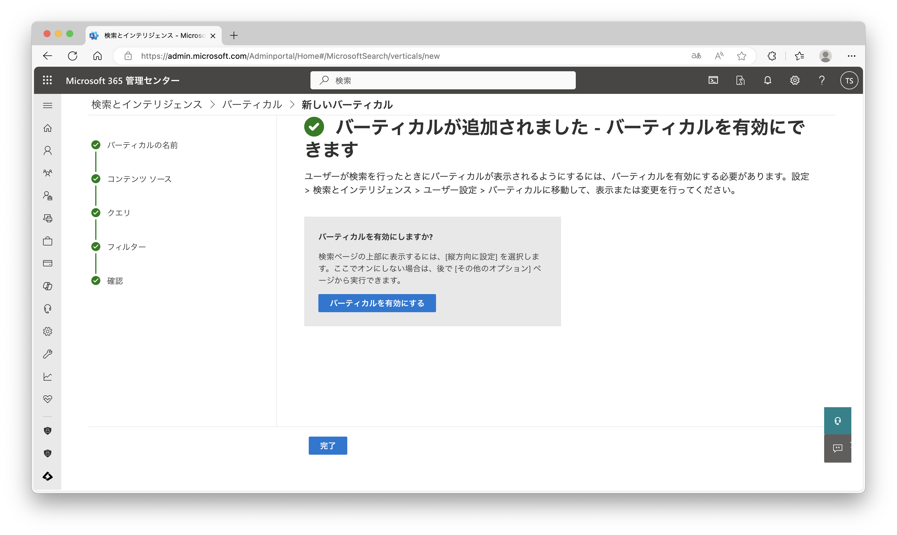

# Microsoft Search の Graph コネクタ ハンズオン

## 事前準備

**重要: 以下の事前準備を満たさない場合はハンズオンを実施できません。必ず確認をお願いします。**

- Microsoft 365 開発者プログラムで作成したテナントまたは試用版テナント
    - Microsoft 365 開発者プログラムに参加し開発者向けサブスクリプションを有効にしたテナントを作成してください。Microsoft 365 開発者プログラムでテナントを作成するためには Visual Studio サブスクリプションが必要です。  
      https://developer.microsoft.com/en-us/microsoft-365/dev-program/
    - Visual Studio サブスクリプションがない場合は、Microsoft 365 E3 の試用版テナントを作成してください。
      https://www.microsoft.com/ja-jp/microsoft-365/enterprise/e3/
    - ご利用のアカウントは **グローバル管理者** のアクセス許可が必要です。

## 開発環境

- Windows または MacOS
- PowerShell

## 参考 URL

https://learn.microsoft.com/ja-jp/microsoftsearch/csv-connector

## ハンズオン

このハンズオンでは SharePoint サイトを使用します。どのサイトを使用するかは任意ですが、このハンズオンではルート サイト (`https://{{tenantname}}.sharepoint.com`) を使用する前提で進めます。

### SharePoint に CSV ファイルをアップロードする

1. SharePoint サイトを開きます。

1. 既定のドキュメント ライブラリに `helpdesk.csv` をアップロードします。


1. アップロードしたファイルを開きます。文字化けがないことを確認します。文字化けしている場合は、文字コードが **UTF-8 (BOM)** であることを確認してください。


### SharePoint アプリのアクセス許可を有効にする

1. PnP PowerShell をインストールします。PowerShell で以下のコマンドを実行します。

    ```pwsh
    Install-Module -Name PnP.PowerShell -Scope CurrentUser
    ```

1. PnP PowerShell をインポートします。

    ```pwsh
    Import-Module -Name PnP.PowerShell
    ```

1. PnP PowerShell で使用するEntra ID アプリケーションを登録します。以下のコマンドを実行します。

    ```pwsh
    Register-PnPEntraIDAppForInteractiveLogin -ApplicationName "PnP PowerShell" -Tenant {{tenantname}}.onmicrosoft.com -Interactive
    ```

1. Entra ID アプリケーションを登録のためのログイン画面が表示されるのでログインします。

1. Entra ID アプリケーションへのアクセス許可のためのログイン画面が表示されるのでログインします。

1. アクセス許可で **組織の代理として同意する** を選択して **承諾** をクリックします (表示されない場合があります)。

1. **クライアント ID** が表示されるのでメモ帳に控えます。

1. 上記の **クライアント ID** を使用して PnP PowerShell にログインします。

    ```pwsh
    Connect-PnPOnline {{tenantname}}-admin.sharepoint.com -Interactive -ClientId {{clientid}}
    ```

1. SharePoint アプリのアクセス許可を有効にします。

    ```pwsh
    Set-PnPTenant –DisableCustomAppAuthentication $false
    ```

1. 設定が反映されていることを確認します。

    ```pwsh
    Get-PnPTenant | select DisableCustomAppAuthentication 
    ```

### SharePoint にアプリを登録する

1. SharePoint のアプリ登録ページ (`https://{{tenantname}}.sharepoint.com/_layouts/15/appregnew.aspx`) を開きます。

1. 以下の項目を入力し **作成** をクリックします。

    |項目名|項目値|
    |-|-|
    |クライアント ID|**生成** ボタンをクリックして自動生成|
    |クライアント シークレット|**生成** ボタンをクリックして自動生成|
    |タイトル|`Microsoft Search`|
    |アプリ ドメイン|`admin.microsoft.com`|
    |リダイレクト先の URI|`https://admin.microsoft.com`|


1. **アプリ ID が正常に作成されました** と表示されるので **クライアント ID** と **クライアント シークレット** をメモ帳に控えます。


1. SharePoint のアプリ構成ページ (`https://{{tenantname}}.sharepoint.com/_layouts/15/appinv.aspx`) を開きます。

1. **アプリ ID** に上記の **クライアント ID** を入力して **参照** をクリックします。

1. **権限の要求 XML** に以下の内容を入力し **作成** をクリックします。

    ```xml
    <AppPermissionRequests AllowAppOnlyPolicy="true">
      <AppPermissionRequest Scope="http://sharepoint/content/sitecollection/web" Right="Read" />
    </AppPermissionRequests>
    ```


1. 確認のメッセージが表示されるので **信頼する** をクリックします。


### CSV コネクタを作成する

1. [Microsoft 365 管理センター](https://admin.microsoft.com/) を開きます。

1. メニューの **すべて表示** - **設定** - **検索とインテリジェンス** をクリックします。

1. **データ ソース** タブの **接続の追加** をクリックします。

1. **データ ソースに接続する** で **CSV** を選択して **次へ** をクリックします。


1. **接続名と ID を作成する** で以下の項目を入力し **保存して続行する** をクリックします。

    |項目名|項目値|
    |-|-|
    |接続 ID|`helpdesk`|
    |名前|`helpdesk`|
    |説明|`IT ヘルプデスクの FAQ (よくある質問) は、ユーザーがよく抱える疑問や問題に対する回答をまとめたものです。これにより、ユーザーは自己解決を図ることができ、ヘルプデスクへの問い合わせを減らすことができます。`|
    |表示名|`ヘルプデスク`|
    |接続アイコン|変更しない|
    |通知|選択|


1. **データ ソース設定** で以下の項目を入力します。**テスト接続** をクリックしてエラーが出ないことを確認します。**保存して続行する** をクリックします。

    |項目名|項目値|
    |-|-|
    |データ ソースの選択|`SharePoint`|
    |SharePoint サイト|`https://{{tenantname}}.sharepoint.com`|
    |ドキュメント ライブラリ|`Shared Documents`|
    |ファイルのパス|`helpdesk.csv`|
    |OAuth プロバイダー|`SharePoint プロバイダー`|
    |認証の種類|`OAuth 2.0`|
    |クライアント ID|上記の手順で作成したクライアント ID|
    |クライアント シークレット|上記の手順で作成したクライアント シークレット|


1. **区切り記号の設定** で以下の項目を入力し **保存して続行する** をクリックします。

    |項目名|項目値|
    |-|-|
    |複数項目の区切り記号|`None`|


1. **解析されたプロパティの設定** で以下の項目を入力し **保存して続行する** をクリックします。

    |SourceProperties|Data Type|Unique Identifier|Allowed Users|Allowed Groups|
    |-|-|-|-|-|
    |ID|`Int64`|X|||
    |Category|`String`||||
    |Question|`String`||||
    |Answer|`String`||||
    |Url|`String`|||
    |Created|`DateTime`||||
    |Modified|`DateTime`||||


1. **プロパティ ラベルの割り当て** で以下の項目を入力し **保存して続行する** をクリックします。

    |ラベル|ソースのプロパティ|
    |-|-|
    |Title|`Question`|
    |url|`Url`|
    |Last modified by|(なし)|
    |Last modified date time|`Modified`|
    |File name|(なし)|
    |File extension|(なし)|
    |Created by|(なし)|
    |Created date time|`Created`|
    |Authors|(該当しない)|
    |IconUrl|(なし)|


1. **スキーマの管理** でで以下の項目を入力し **保存して続行する** をクリックします。

    |項目名|項目値|
    |-|-|
    |コンテンツ プロパティ|`Answer`|

    |ソースのプロパティ|エイリアス|クエリ|検索|取得|絞り込み|
    |-|-|-|-|-|-|
    |Answer|||X|||
    |Category||X||X|X|
    |Created||X||X|X|
    |ID||X||X||
    |Modified||X||X|X|
    |Question|||X|X||
    |Url|||X|X||


1. **検索アクセス許可を管理する** で以下の項目を入力し **保存して続行する** をクリックします。

    |項目名|項目値|
    |-|-|
    |すべてのユーザー|選択|


1. **更新の設定** で以下の項目を入力し **保存して続行する** をクリックします。

    |項目名|項目値|
    |-|-|
    |タイム ゾーン|`(UTC+09:00) Osaka, Sapporo, Tokyo`|
    |フル クロール|`毎日`|


1. **接続を確認する** で **公開** をクリックします。


1. **接続が公開されました** で以下の項目を入力し **保存して閉じる** をクリックします (表示されない場合があります)。

    |項目名|項目値|
    |-|-|
    |\[すべて\] バーティカルに結果を表示する|`オン`|


1. 作成した接続が **準備完了** になるまで待ちます (およそ 10 分程度かかります)。


### コネクタの結果の管理

1. [Microsoft 365 管理センター](https://admin.microsoft.com/) を開きます。

1. メニューの **すべて表示** - **設定** - **検索とインテリジェンス** をクリックします。

1. **ユーザー設定** タブの **バーティカル** - **すべて** - **コネクタの結果を管理する** をクリックします。  

1. 以下の項目を入力し **保存** をクリックします。

    |項目名|項目値|
    |-|-|
    |コネクタの結果を含める|選択|
    |結果をインラインで表示する|選択|
    |helpdesk|選択|


### 結果の種類の作成

1. [Microsoft 365 管理センター](https://admin.microsoft.com/) を開きます。

1. メニューの **すべて表示** - **設定** - **検索とインテリジェンス** をクリックします。

1. **ユーザー設定** タブの **結果の種類** - **追加** をクリックします。  

1. **結果の種類に名前を付ける** で以下の項目を入力し **次へ** をクリックします。

    |項目名|項目値|
    |-|-|
    |名前|`ヘルプデスク`|


1. **コンテンツ ソースを選択する** で以下の項目を入力し **次へ** をクリックします。

    |項目名|項目値|
    |-|-|
    |コンテンツ ソース|`helpdesk`|


1. **結果の種類のルールを設定する** で **次へ** をクリックします。

1. **レイアウトをデザインする** で `helpdesk.json` の内容を貼り付けて **次へ** をクリックします。


1. **結果の種類の設定を確認する** で **結果の種類を追加** をクリックします。


1. 確認のメッセージが表示されるので **完了** をクリックします。

### バーティカルの作成

1. [Microsoft 365 管理センター](https://admin.microsoft.com/) を開きます。

1. メニューの **すべて表示** - **設定** - **検索とインテリジェンス** をクリックします。

1. **ユーザー設定** タブの **バーティカル** - **追加** をクリックします。  

1. **バーティカルに名前を付ける** で以下の項目を入力し **次へ** をクリックします。

    |項目名|項目値|
    |-|-|
    |名前|`ヘルプデスク`|


1. **コンテンツ ソースを選択する** で以下の項目を入力し **次へ** をクリックします。

    |項目名|項目値|
    |-|-|
    |コンテンツ ソース|`helpdesk`|


1. **クエリを追加する** で **次へ** をクリックします。

1. **フィルター** で **次へ** をクリックします。

1. **バーティカルの設定を確認する** で **バーティカルを追加** をクリックします。


1. 確認のメッセージが表示されるので **バーティカルを有効にする** をクリックします。



1. **完了** をクリックします。

### 動作を確認する

1. [Microsoft 365 ホーム ページ](https://www.office.com/?auth=2) を開きます。

1. 検索バーで `パスワード` と入力して検索します。


### Copilot for Microsoft 365 での動作 (デモのみ)

1. Copilot チャットで `パスワードを忘れました。FAQに対応方法はありますか？` と入力します。


